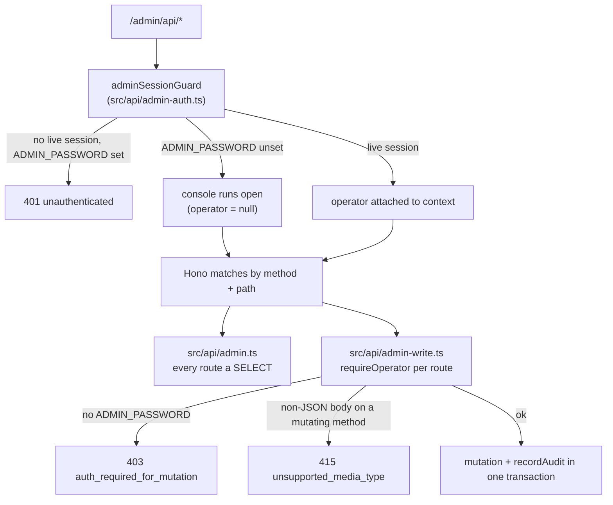

# Console

`/admin` is a cross-merchant operator console: one sign-in sees every merchant's
payments plus internals the merchant API deliberately hides (HD derivation index, frozen
rate, webhook delivery attempts, ledger entries). The design record for how its write
surface came to exist — including the departures discovered while building it — is
[`/design/CONSOLE-WRITE-PLAN`](/design/CONSOLE-WRITE-PLAN); this page describes the
architecture as implemented.

## Reads and writes are two routers at one prefix

`src/api/admin.ts`'s own header states the promise directly: *"Every route in this file is
a SELECT. Nothing here mutates the payment state machine, so the console can never
corrupt a payment no matter what it is asked to render."* Keeping mutations in a second
file, `src/api/admin-write.ts`, is what keeps that sentence checkable — a single `POST`
added "just here" to the read router would quietly void it. Both mount at the same
`/admin/api` prefix in `src/api/routes.ts`; Hono matches by method and path together, so
nothing collides.

`adminSessionGuard` is attached once, ahead of both routers (`app.use("/admin/api/*",
adminSessionGuard)`), and is what makes every route under the prefix — reads and writes
alike — require a session once `ADMIN_PASSWORD` is set. `requireOperator` is deliberately
**not** a second `use("*")` on the write router: a wildcard there would match by path, not
by which router ultimately answers, and would sit in front of the read routes too. It is
attached per write route instead, one line each, which costs a little repetition and buys
visibility — the guard is readable at every mutation rather than an emergent property of
file layout.

## Operator identity: `admin_users` and `admin_sessions`

Operators are people with a password, deliberately not merchants with an API key — see
[Data model](/architecture/data-model) for why `admin_users` is a separate table from
`clients`. Passwords are **argon2id**, never a bare digest: an unsalted SHA-256 of a
human-chosen password is a rainbow-table lookup away from the plaintext, which is exactly
wrong for the thing an operator reuses, unlike a 24-byte random API key where SHA-256 is
fine.

`bootstrapOperator()` (`services/admin-auth.ts`) runs on every boot and keeps exactly one
account — `ADMIN_USER` (default `admin`) — in step with `ADMIN_PASSWORD`:

- **No account yet** → creates it.
- **Password differs from the hash on file** → rotates the hash, and **revokes every open
  session for that operator** — a password change that left the old browser signed in
  would not have revoked anything.
- **Account deactivated** → reactivates it, since the bootstrap account is the recovery
  path for a deployment nobody can otherwise sign in to.

`admin_sessions` holds one row per signed-in browser: the cookie carries a random token,
the row stores its SHA-256, so a database dump cannot be replayed as a login. A session
slides — extended once it is past halfway to its TTL — so an operator watching a payment
settle is not signed out mid-incident, without turning every request into a write to
extend it. `sweepExpiredSessions()` runs after every successful login, the cheapest moment
to pay for it and the one point that reliably happens on a console nobody is actively
polling.

`ADMIN_PASSWORD` unset leaves the console **open** — every read and (per below) no write
— which is development-only: `preflight()` refuses to boot production without it, so a
deployed instance can never be reachable and unauthenticated at once.

## `requireOperator`: the extra bar a mutation clears

Every route in `admin-write.ts` sits behind `requireOperator`, which adds two checks on
top of the session guard:

1. **An open console may not write.** With no `ADMIN_PASSWORD` there is no account, so
   there is no identity, so a change cannot be attributed — and an unattributable
   mutation is exactly what the repository's own architecture rule forbids. Reads stay
   open in development exactly as before; only writes are refused, with
   `403 auth_required_for_mutation`. Production cannot reach this branch: `preflight()`
   will not boot without `ADMIN_PASSWORD`.
2. **The body must be JSON**, checked for every method except `GET`, `HEAD`, and
   `DELETE`. `SameSite=Lax` on the session cookie already keeps it off any cross-site
   `POST`, so this is defence in depth rather than the primary control — but it is the
   half that does not depend on a browser's cookie behaviour, and it costs one header
   check.

## In-transaction audit: `recordAudit`

**Every console mutation needs an operator and an audit row**, and the row is written
**inside the mutation's own transaction** — `recordAudit(tx, entry)`
(`services/audit.ts`) takes the caller's transaction handle rather than opening its own,
so a committed change can never exist without its record. `admin_audit_log` is
append-only by design: nothing updates or deletes a row, because a trail you can edit
answers a different question than the one it exists for. See
[Data model](/architecture/data-model) for the table's shape and its snapshot-not-just-
reference treatment of the operator.

`detail` is built by hand at each call site from an explicit list of fields — **never a
spread of a database row** (a `clients` row carries `apiKeyHash` and `webhookSecret`) —
and is scrubbed again on the way in by `scrub()`, which masks anything credential-shaped
at any depth using the same key-name rule the logging sink applies to attributes, then
passes the result through `redact()` as a second, independent pass. No credential
reaches this table twice-guarded like that by accident.

`recordDetachedAudit()` is the single documented exception to "same transaction as the
change": `POST /admin/api/payments` reuses `createPayment()` from
`services/payments.ts` rather than reimplementing it, and that function owns its own
insert. Threading a transaction handle through a core settlement service just to satisfy
the console would be a worse trade than the gap this leaves — stated rather than hidden:
if the detached audit insert fails, the payment still exists and is still correct, only
the attribution row is missing, and the failure is logged at `error` with the same trace
id the payment's own "payment created" log line carries.

## `ADMIN_PASSWORD` as the bootstrap and recovery lever

`ADMIN_PASSWORD` is simultaneously the environment variable that:

- makes `preflight()` pass in production (its absence there is fatal — a deployed console
  can never be silently open),
- is the password `bootstrapOperator()` gives the `ADMIN_USER` account on every boot, and
- is therefore the recovery path for a deployment nobody can sign in to: change the
  variable and restart, and that operator's password rotates and its open sessions are
  revoked.

There is deliberately no separate "reset password" flow yet — see
[Data model](/architecture/data-model)'s `admin_users` section and the console's own
*Operators* view, which is read-only because creating, disabling or resetting an account
still needs a role model this build does not have: with a single undifferentiated
operator role, any signed-in account could grant itself peers, and `ADMIN_PASSWORD` would
stop being a trustworthy recovery path.

## What the console cannot do (by design, today)

The plan's own non-objectives are still true of the shipped write surface: no operator
(`admin_users`) CRUD from the browser, no balance adjustments or refunds, no resolving
`underpaid_expired` payments, no re-queueing dead webhooks, no manual sweeps, and no
deleting or editing a payment once created — a payment is ledger state, and the console
may add one but never remove one. Each of these would mutate money or access control
directly rather than configuration, and each needs more than an audit row before it can
exist safely.
