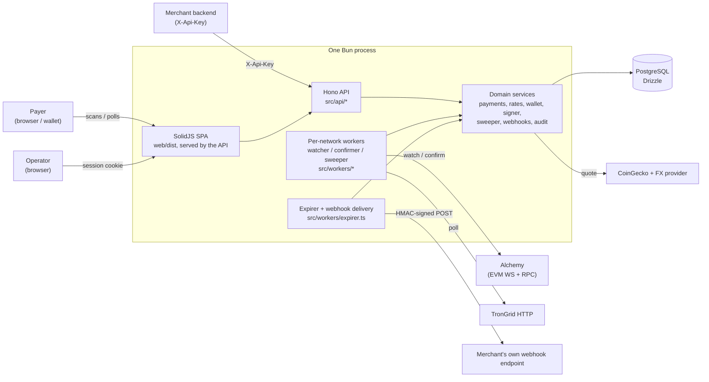
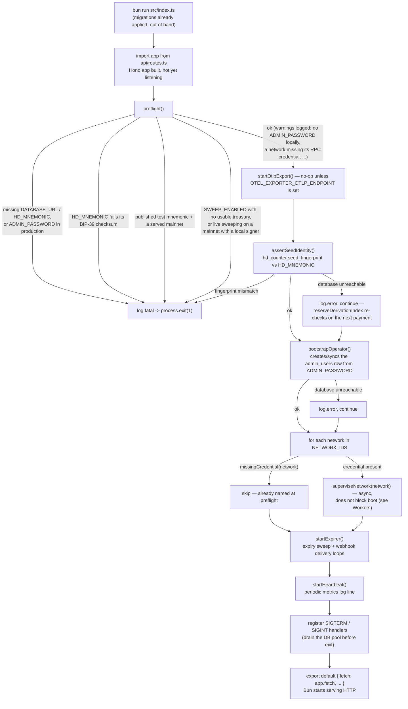

# Overview

## What this is

A crypto payment gateway: a merchant charges in **Colombian pesos (COP)** and the payer
settles in a stablecoin or a chain's own coin. The gateway freezes a COP↔crypto quote,
derives a unique receiving address per payment, detects the on-chain transfer, waits out
the network's confirmation depth, and credits the merchant's COP balance — then notifies
them with a signed webhook.

It is one Bun process: a [Hono](https://hono.dev) HTTP API and a set of in-process
workers (one watcher/confirmer pair per network, an expirer, a webhook deliverer, and —
where enabled — a sweeper and a reconciliation job), all reading and writing one
PostgreSQL database through [Drizzle ORM](https://orm.drizzle.team). A SolidJS single-page
app, built with Vite and served from `web/dist`, provides both payer-facing surfaces the
backend renders: the checkout at `/pay/:publicId` and the operator console at `/admin`.

There is no queue, no second service, and no leader election. `railway.json` pins the
deployed container to one replica for exactly that reason — see
[Workers](/architecture/workers) for what would need to change to split them out.

## Stack

| Layer | Technology |
|---|---|
| Runtime | Bun |
| HTTP | Hono |
| Database | PostgreSQL, via Drizzle ORM (`src/db/schema.ts`, migrations in `drizzle/`) |
| EVM chain access | viem, Alchemy (WebSocket subscriptions + HTTP backfill) |
| Tron chain access | TronGrid HTTP API (no WebSocket exists for Tron) |
| Pricing | CoinGecko (asset → USD) and an FX provider (USD → COP) — see [Pricing](/architecture/pricing) |
| Frontend | SolidJS, TanStack Query/Router, Tailwind CSS v4, built with Vite |
| Observability | A single logging/metrics service under `src/observability/` — see [Observability](/architecture/observability) |

## Networks and assets

Every network the registry knows about lives in `NETWORKS` (`src/config.ts`); the subset
actually quoted and watched is `NETWORK_IDS` — every testnet, plus two mainnets only when
`ENABLE_MAINNETS` is set. By default this build serves **five networks**, four EVM and one
Tron:

| Network | Family | Assets | Native coin accepted |
|---|---|---|---|
| `eth-sepolia` | EVM | USDC | — (quotes stablecoins only) |
| `base-sepolia` | EVM | USDC | — |
| `bsc-testnet` | EVM | USDT, USDC (18 decimals) | BNB |
| `polygon-amoy` | EVM | USDC | POL |
| `tron-nile` | Tron | USDT | TRX |

`bsc` and `polygon` are defined in the same registry — USDT/USDC/BNB and USDC/USDT/POL
respectively — but withheld from `NETWORK_IDS` unless `ENABLE_MAINNETS=true`. A withheld
network still resolves for historical rows (`NETWORKS` keeps every definition), it just
cannot be quoted or given a new address. This is not an EVM-only or USDC-only gateway:
USDT is live wherever the registry defines it, and a chain's own coin (BNB, POL, TRX) is a
first-class quotable asset with its own detection path — see
[Workers](/architecture/workers) for why that path is a second worker rather than a
variant of the token one.

Decimals are a property of the **(network, asset) pairing**, never of the symbol — USDC is
6 decimals on Polygon and 18 on BSC — so every conversion reads them from the registry.
See [Invariants](/architecture/invariants).

## Component view

## Boot sequence

`src/index.ts` is the only entrypoint; `preflight()` and everything below it runs only
from there, which is why importing `src/config.ts` (or `src/api/routes.ts`, for the test
scripts) must stay side-effect free. Migrations are **not** part of this sequence — they
run as a separate step before the process starts (`bun run db:migrate` locally,
`bun run db:deploy` in the deployed container's start command, per `railway.json`).

Two asymmetries worth naming:

- **The seed and operator checks are deferred, not blocking.** Both need the database,
  and a database that is merely unreachable at the instant of boot must not stop the
  gateway from serving payments — so a connection failure there logs at `error` and moves
  on; only an actual **mismatch** (`SeedMismatchError`) is fatal, because continuing past
  it would risk issuing a derivation index the loaded mnemonic does not own.
- **Per-network supervision does not block startup.** `superviseNetwork()` for each
  network fires an async probe loop and returns immediately; the network's watcher,
  confirmer and (if enabled) sweeper only start once that network's RPC actually answers.
  A network stuck retrying its probe never delays the other four, or the HTTP server. See
  [Workers](/architecture/workers).

## Where to read next

- [Data model](/architecture/data-model) — every table, enum, and why raw amounts are
  `numeric(78,0)`.
- [Payment lifecycle](/architecture/payment-lifecycle) — the state machine end to end.
- [Workers](/architecture/workers) — what runs per network, on what cadence, and why the
  native-coin watcher is a separate worker.
- [Pricing](/architecture/pricing) — the two-leg quote and its degradation ladder.
- [Wallets & keys](/architecture/wallets-and-keys) — HD derivation, the signer boundary.
- [Sweeping](/architecture/sweeping) — consolidating deposit addresses to a treasury.
- [Console](/architecture/console) — the read/write split behind `/admin`.
- [Observability](/architecture/observability) — logging, tracing, metrics.
- [Invariants](/architecture/invariants) — the rules every change has to keep holding.

The repository's own guide (`AGENTS.md`) and `README.md` stay the sources of truth for
day-to-day commands (`bun run dev`, `bun run typecheck`, the standalone test scripts); this
section explains the shape those commands operate on.
