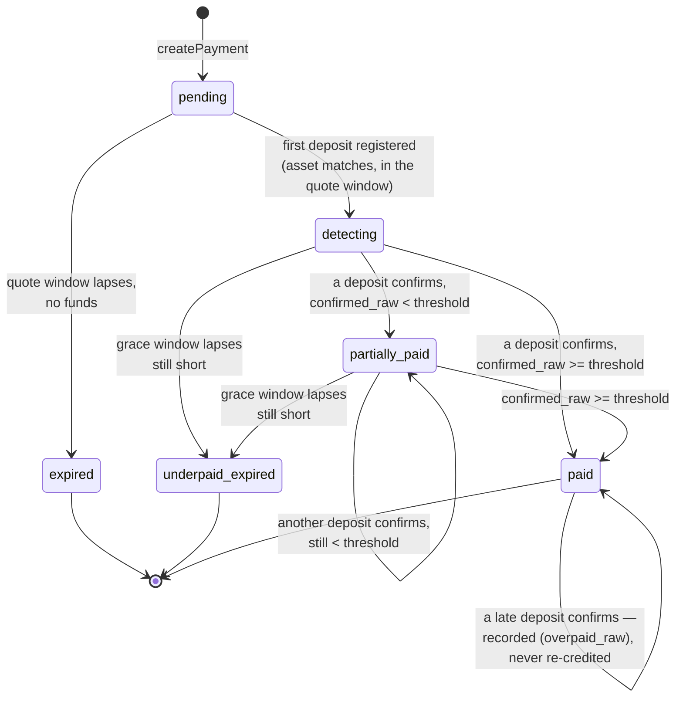
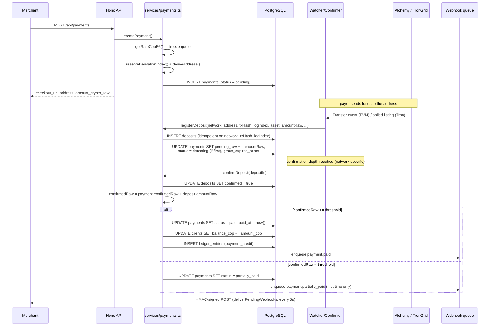

# Payment lifecycle

The payment state machine is the spine of the gateway. It lives entirely in
`src/services/payments.ts`, is driven by three entry points —
`createPayment`, `registerDeposit`, `confirmDeposit` — plus the periodic
`expireStalePayments`, and every transition (and every *refusal* to transition) is logged
with the numbers the decision was made on. This page derives the state diagram and the
sequence from that file and from the `payment_status` enum in `src/db/schema.ts`.

## States



`threshold` is `requiredWithTolerance(amountCryptoRaw)` — the required amount minus the
dust tolerance (`DUST_TOLERANCE_BPS`, 0.5% by default):

```ts
export function requiredWithTolerance(amountCryptoRaw: bigint): bigint {
  return (amountCryptoRaw * (10_000n - env.dustBps)) / 10_000n;
}
```

## End-to-end sequence



## Create: freezing the quote

`createPayment` looks up the `(network, asset)` pairing via `assetFor` (rejecting an
unsupported combination), enforces a 1,000 COP minimum, then in one call:

1. `getRateCopE6(asset)` — the frozen COP-per-unit rate, spread already applied. See
   [Pricing](/architecture/pricing).
2. `copToRaw(amountCop, rate, token.decimals)` — the required raw amount, **rounded up**
   so the merchant never receives less than the COP value.
3. `reserveDerivationIndex()` + `deriveAddress()` — a fresh HD address. See
   [Wallets & keys](/architecture/wallets-and-keys).

The row is inserted with `status: "pending"` and `quoteExpiresAt = now + QUOTE_TTL_MINUTES`
(15 minutes by default). Nothing about the quote changes after this insert — the payer
always pays at the rate shown.

## Register: a transfer lands on-chain

`registerDeposit` is called by every watcher (`workers/watcher.ts`,
`workers/native-watcher.ts`, `workers/tron-watcher.ts`) with the same shape regardless of
chain family, and runs inside one transaction with the payment row locked (`FOR UPDATE`):

1. **Unknown address** — no payment owns `(network, address)`: ignored
   (`deposits.ignored{reason=unknown_address}`), nothing written.
2. **Insert the deposit**, `ON CONFLICT DO NOTHING` on `(network, txHash, logIndex)`. A
   conflict means the WebSocket and the backfill both saw it, or a scan repeated —
   ignored as `duplicate`.
3. **Wrong-asset refusal.** If `deposit.asset !== payment.asset`, the row is recorded (for
   reconciliation) but the function returns without touching `pendingRaw` or the status.
   A network now serves several assets behind one address, and a payer who sends the
   wrong one has sent real value to a real address of ours — crediting it would settle
   the payment at a rate nobody quoted. See [Invariants](/architecture/invariants).
4. **Terminal-payment refusal.** `paid`, `expired`, and `underpaid_expired` no longer
   accept funds that change their outcome. The deposit is still recorded, for audit and
   manual reconciliation, and logged at `warn`.
5. **Window check.** The deposit must have arrived at or before `quoteExpiresAt`, or
   before `graceExpiresAt` once a grace window is open. Outside both, it is recorded and
   ignored as `late` — again, left for manual reconciliation rather than silently
   dropped.
6. **Apply.** `pendingRaw += amountRaw`. If this is the payment's first deposit, the
   status moves `pending → detecting` and `graceExpiresAt` is set to
   `now + GRACE_TTL_MINUTES` (90 minutes by default) — the window inside which a partial
   payment can still be completed at the frozen rate.

Every one of these outcomes is logged explicitly, including the ones that change nothing:
a deposit that arrives and has no effect is, from the outside, indistinguishable from a
bug unless the refusal states its reason.

## Confirm: maturity, settlement, and partials

`confirmDeposit` is called by the confirmer once a deposit has cleared the network's
confirmation depth and re-passed an anti-reorg check (the transaction is still mined with
a successful receipt). Inside its own locked transaction:

1. Marks the deposit `confirmed = true`.
2. Re-applies the same asset-mismatch guard as `registerDeposit` — this time keeping the
   amount out of `confirmedRaw`, which is what actually settles a payment, rather than out
   of `pendingRaw`.
3. Computes `confirmedRaw = payment.confirmedRaw + deposit.amountRaw`,
   `pendingRaw = payment.pendingRaw - deposit.amountRaw`, and compares `confirmedRaw`
   against `requiredWithTolerance(amountCryptoRaw)`.
4. **Already `paid`** — a deposit that confirms after settlement (a late top-up, or a
   deposit that was mid-flight when the threshold was first reached by another one) must
   **not** re-credit the merchant. The confirmed/pending numbers still move, and any
   excess above `amountCryptoRaw` is tracked as `overpaidRaw`; nothing else happens. This
   is the double-credit guard from [Invariants](/architecture/invariants).
5. **`confirmedRaw >= threshold`** — the settling case: `status = paid`, `paidAt = now()`,
   the client's `balance_cop` is credited by `amountCop`, a `ledger_entries` row is
   written, and `payment.paid` is enqueued — all inside the same transaction, so a
   crediting can never exist without its ledger row.
6. **`confirmedRaw < threshold`** — `status = partially_paid`; `payment.partially_paid`
   is enqueued only the first time a payment enters this state (a second confirmed
   deposit that is still short does not re-fire the webhook).

## Expire: two different endings

`expireStalePayments` runs every 20 seconds (`workers/expirer.ts`) and moves two disjoint
sets of rows, using Drizzle's typed comparisons rather than a raw SQL date literal (a
past bug: a raw template binds the JS `Date` in a way the driver rejects, so nothing ever
expired):

- **`pending` with `quoteExpiresAt` in the past** → `expired`. No funds ever arrived; a
  `payment.expired` webhook is enqueued.
- **`detecting` or `partially_paid` with `graceExpiresAt` in the past** →
  `underpaid_expired`. Funds arrived but never reached the threshold before the grace
  window ran out — a state that needs a human, not just a webhook, because real value is
  sitting at an address whose payment will never settle on its own. A `payment.
  underpaid_expired` webhook is enqueued and the log line is a `warn`, not an `info`.

Both endings are terminal in the `payment_status` enum: nothing in `src/` moves a payment
back out of `expired` or `underpaid_expired` today. The console surfaces
`underpaid_expired` payments and the funds held against them, but resolving one — a
refund or a manual credit — is explicitly out of scope for the current write surface (see
[Console](/architecture/console)).

## Deposits recorded but never applied

Three of the outcomes above — wrong asset, terminal payment, and late arrival — share a
shape: the `deposits` row is written unconditionally, and only the *effect* on the
payment is withheld. This is intentional. The transfer is real and on-chain regardless of
whether it can settle anything, and `deposits` is also what
[Sweeping](/architecture/sweeping)'s candidate selection reads from — value in an asset
the payment never quoted is exactly the kind of value most likely to be stranded, and it
has to be visible to that subsystem even though `payments.confirmed_raw` never counted
it.
