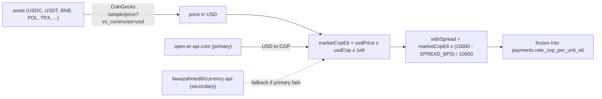

# Pricing

`src/services/rates.ts` turns a COP amount into a frozen raw crypto amount, and back —
the mechanism [Payment lifecycle](/architecture/payment-lifecycle)'s `createPayment` and
[Sweeping](/architecture/sweeping)'s economic test both depend on. Every input to a
quote is logged (`rate.asset_usd`, `rate.usd_cop`, `rate.market_cop_e6`,
`rate.cop_per_unit_e6`, `config.spread_bps`), because a quote is frozen into the payment
row and "why was the amount that" has to be answerable after the fact from the log alone.

## Two legs, not one

CoinGecko dropped COP from `/simple/supported_vs_currencies` — asking for
`vs_currencies=cop` now returns HTTP 200 with an empty object rather than an error — so
the gateway cannot ask for an asset's COP price directly. Pricing is a cross of two
independently-sourced legs instead:



- **Asset → USD.** `fetchUsdPrice(asset)` calls
  `https://api.coingecko.com/api/v3/simple/price?ids=<id>&vs_currencies=usd`, where `<id>`
  comes from the `COINGECKO_IDS` map in `src/config.ts` (`USDC → usd-coin`,
  `TRX → tron`, `POL → polygon-ecosystem-token` — deliberately *not* the still-live
  `matic-network` id, which prices the pre-rebrand token at a different rate).
- **USD → COP.** `fetchUsdCop()` tries `open.er-api.com` first, then
  `cdn.jsdelivr.net/npm/@fawazahmed0/currency-api` — a secondary result is logged at
  `warn` even on success, since serving from it at all means the primary is degraded.

## Spread

The market rate is a cross of both legs; the gateway then **lowers** the COP-per-token
rate by `SPREAD_BPS` (75 basis points by default) before freezing it:

```ts
const marketE6 = BigInt(Math.round(usdPrice * usdCop * 1e6));
const withSpread = (marketE6 * (10_000n - env.spreadBps)) / 10_000n;
```

Lowering the COP-per-unit rate means the payer's frozen `amountCryptoRaw` (computed from
this rate via `copToRaw`, see below) is slightly *larger* than the raw market cross would
require — the payer sends a bit more crypto for the same COP charge, and the difference
is the gateway's margin. The spread is applied once, at quote time, and is part of what
gets frozen; it does not recur anywhere else in the payment path.

## Caching and TTLs

Two independent caches, because the two legs move at different speeds:

| Cache | TTL | Why |
|---|---|---|
| Per-asset quote (`rateCache`) | 60s (`RATE_TTL_MS`) | asset prices move continuously |
| USD→COP (`fxCache`) | 600s / 10 min (`FX_TTL_MS`) | FX moves far more slowly |
| Stale-cache grace, either leg | 600s / 10 min (`STALE_MS`) | how long a cached value may cover for a provider outage |

A quote request first checks its own cache; on a miss it fetches both legs concurrently
(`Promise.all`). A **fresh** hit never touches a provider at all.

## Degradation ladder

Both legs share the same three-step fallback, applied independently — a failure fetching
the FX leg and a failure fetching the asset leg are handled by the same ladder, just
against different cached values:

1. **Stale cache**, up to `STALE_MS` (10 minutes) old. Logged at `warn`
   (`rates.degraded{source=stale_cache}`) — service continues, but the quote is
   demonstrably not current-market.
2. **Static fallback** — `FALLBACK_USD_COP`, the FX leg's last resort only. Logged at
   `error` (`rates.degraded{source=static_fallback}`). There is no equivalent static
   fallback for the asset leg: an asset price has no sane constant to fall back to, so a
   stale-cache miss there goes straight to refusal.
3. **Refuse to quote.** No fresh value, no usable stale cache, no static fallback (or none
   applicable) — the call throws, logged at `error`
   (`rates.degraded{source=refused}`), and `createPayment` never inserts a row. Refusing
   beats guessing: an under-priced quote directly costs the merchant money.

`FALLBACK_USD_COP` is unset by default, which means "refuse to quote rather than guess" is
the out-of-the-box behavior when every FX provider is down and the cache has fully aged
out.

## Freezing the quote

`createPayment` calls `getRateCopE6(asset)` once, and the returned rate is written to
`payments.rate_cop_per_unit_e6` — nothing recomputes it afterward. The raw amount the
payer must send is derived from that frozen rate with `copToRaw`, which **always rounds
up**:

```ts
export function copToRaw(amountCop, rateCopPerUnitE6, decimals) {
  const scale = 10n ** BigInt(decimals);
  const num = amountCop * 1_000_000n * scale;
  return (num + rateCopPerUnitE6 - 1n) / rateCopPerUnitE6; // ceil division
}
```

Rounding up is load-bearing, not cosmetic: rounding down would under-collect by a
fraction of a raw unit on every single payment, and `decimals` is read per `(network,
asset)` pairing from the registry — never assumed to be 6 — for the same reason a wrong
constant here would silently misprice every 18-decimal asset. See
[Invariants](/architecture/invariants).

## Consumers besides a payment quote

- **Sweeping's economic test** (`services/sweeper.ts`, `economicsFor`) reprices
  `SWEEP_MIN_USD` through the same `copToRaw` path and calls `getRateCopE6` for both the
  swept asset and the network's fee currency, so a sweep's floor and its fee-vs-value test
  are expressed in the same unit (COP) a quote is. A rate that fails to resolve here
  degrades the *sweep* to `unpriceable` rather than throwing — a stuck price must never
  abort a worker tick, only defer one candidate. See [Sweeping](/architecture/sweeping).
- **`getUsdCopRate()`** exposes the FX leg alone, with no spread, for exactly that
  floor-conversion use — it is a threshold, not a quote, and applying the gateway's
  margin to it would only mean sweeping slightly later than necessary.
- **`primeRateCache()`** seeds the cache directly for the offline test scripts, so
  `POST /admin/api/payments` can be exercised without reaching CoinGecko while still
  going through the real `createPayment()` — the one thing that route has to prove.
