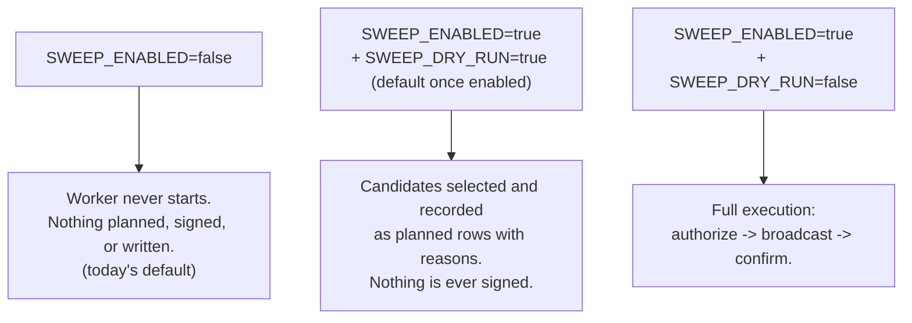

# Sweeping

Sweeping consolidates the value sitting at per-payment deposit addresses into one
treasury address per chain family. The canonical design — the full rationale, every
mechanism, the data model derivation, and the phase-by-phase acceptance criteria — is
[`/design/SWEEPING-PLAN`](/design/SWEEPING-PLAN); this page is a status summary and an
orientation, not a duplicate of it. Read the plan for *why*; read this page for *what
exists right now* and where the code for each piece lives.

## The invariant that makes sweeping safe to build independently

Settlement is **event-sourced**, never balance-based. `registerDeposit` and
`confirmDeposit` (`services/payments.ts`) accumulate `confirmed_raw` from `Transfer` log
data and from block bodies — there is no `balanceOf`, no `eth_getBalance`, and no
`readContract` anywhere in the payment path. Emptying a deposit address at any moment —
including mid-grace on a `partially_paid` payment — therefore cannot change what that
payment settles at: a later top-up produces a new `Transfer` to the same, now-empty,
address and is still detected and still credited normally.

That is what lets sweeping be a fully separate subsystem, coordinating with nothing:
it never reads from or writes to `payments` or `deposits`' effect on settlement, and it
can never race the state machine in [Payment lifecycle](/architecture/payment-lifecycle).
The one deliberate exception — reconciliation reading a balance to *audit* against the
ledger, never to settle anything — is called out below.

## Three-way switch, not two settings

Dry-run is not a smaller version of live execution — it is what makes Phase 1 shippable
without a signature ever being produced, and it is exempted from the mainnet/custody boot
gate below because it structurally cannot reach one.

## Treasury addresses

`TREASURY_ADDRESS_EVM` and `TREASURY_ADDRESS_TRON` — one per chain family, from the
environment, snapshotted onto every `sweeps` row at plan time so a later change cannot
rewrite history. The gateway **never holds a key for either**: a treasury is a
destination address only, checked for shape at boot (`preflight()`) and for Base58Check
validity again in `treasuryFor()` (`services/sweeper.ts`) before a single sweep plans
against it. See [Wallets & keys](/architecture/wallets-and-keys) for why the treasury key
sits entirely outside the signer boundary.

`preflightSweeping()` refuses to boot when `SWEEP_ENABLED` is set and a served family has
no usable treasury address — planning a sweep with nowhere to send it would write rows
pointing nowhere.

## The probe gate

A pairing acquires a `sweep` mechanism in the `NETWORKS` registry (`src/config.ts`) only
after `scripts/sweep-probe.ts` has confirmed it **on-chain** — whether the token
implements EIP-3009, and, if so, its EIP-712 domain cross-checked against the contract's
own `DOMAIN_SEPARATOR()`. An unverified capability is not a capability: `base-sepolia`'s
USDC is almost certainly EIP-3009-capable (it is the same Circle FiatToken as Sepolia's,
which the probe did confirm) and is deliberately left without a `sweep` entry anyway,
because the probe could not reach that network to check. `sweepFor(network, asset)`
returns `undefined` for any pairing the registry has not marked this way, and
`candidates()` (`services/sweeper.ts`) silently skips those — the safe default, and the
common one until a pairing is probed.

## Phases: what exists today

| Phase | What | Status |
|---|---|---|
| 0 — Capability probe | `scripts/sweep-probe.ts`: confirms EIP-3009 + EIP-712 domain per pairing, no production code | **Done** |
| 1 — Model + policy, dry-run only | Schema, registry `sweep` field, dials, `services/sweeper.ts` policy, `workers/sweeper.ts` in dry-run | **Done** |
| 2 — EIP-3009 on Sepolia | `Signer`/`LocalSigner`, authorize → broadcast → confirm, retry on the stored nonce | **Done, unexercised on-chain** — the signing path is verified via a simulated `eth_call` against the live contract; no value has actually moved (needs a funded relayer and `TREASURY_ADDRESS_EVM`) |
| 3 — Tron | Resource delegation, sweep, un-delegation | **Not started.** The registry correctly marks `tron-nile/USDT` as `sweep: { via: "delegate" }` — the probe established that mechanism exists — but the code to delegate energy is not written, so `EXECUTABLE_VIA` in `services/sweeper.ts` resolves these candidates to `skipped: unimplemented` rather than planning rows nothing will pick up |
| 4 — Native coins | `balance − fee`, with headroom and re-estimation | **Done, unit-tested, unexercised on-chain** — no EVM native network (BSC testnet, Polygon Amoy) has an RPC credential in the reference environment |
| 5 — Batch relayer | Helper contract batching several `sweeps` rows under one `txHash` | **Not started** |
| 6 — Custody + mainnet gate | Boot-time refusal of live sweeping + a served mainnet + a local signer; `RemoteSigner` implementation | **Gate done; `RemoteSigner` not started** — gated on a custody-vendor decision, which the plan correctly treats as a business decision rather than an engineering one |
| Reconciliation (cross-cutting) | `workers/sweep-recon.ts`: on-chain balance vs. ledger expectation | **Done** — runs independently of `SWEEP_ENABLED`, gated by its own `SWEEP_RECON_ENABLED` |

## Reconciliation: the one legitimate balance read

`workers/sweep-recon.ts` is explicit that it is the sole exception to the event-sourced
rule: it reads on-chain balances and compares them against
`Σ confirmed deposits − Σ confirmed sweeps` per `(address, asset)`, batched through
Multicall3 where the chain has it deployed (every network in the registry does). Nothing
it reads feeds `registerDeposit`, `confirmDeposit`, or any payment column — it only logs a
`warn` when drift appears, after excluding two benign cases the plan names explicitly:
value covered by a sweep that is signed or broadcast but not yet confirmed, and value
still below the sweep floor waiting to accumulate.

It exists independently of whether sweeping itself is switched on
(`SWEEP_RECON_ENABLED`), because auditing is useful long before the first signature is
produced — and because the same derived key produces the same address on *every* EVM
chain, a deposit address is technically live on mainnets this gateway does not serve at
all, which is exactly the kind of drift only an independent balance read can surface. See
[Workers](/architecture/workers) for its place in the per-network worker set.

## Where to read more

- Mechanisms (EIP-3009, resource delegation, `prefund`, `native`), the exactly-once
  design, the policy dials, and every open decision:
  [`/design/SWEEPING-PLAN`](/design/SWEEPING-PLAN).
- The signer boundary and account separation the execution phases sign through:
  [Wallets & keys](/architecture/wallets-and-keys).
- The worker loop, its cadence, and how it is gated behind the network probe:
  [Workers](/architecture/workers).
- The `sweeps` table shape and its exactly-once index design:
  [Data model](/architecture/data-model).
