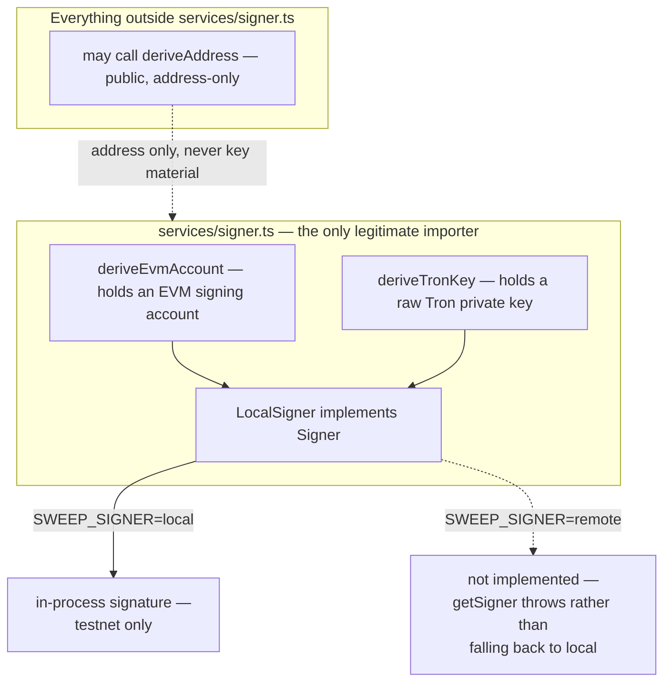

# Wallets & keys

Three files split this concern deliberately: `services/derivation.ts` is pure key math,
`services/wallet.ts` is the database-backed index counter, and `services/signer.ts` is the
**only** place either one may be imported for signing purposes. This page never quotes or
reproduces a mnemonic, a private key, or a derivation path with real key material — only
the shapes.

## One tree, two coin types, two accounts

Every address the gateway hands out or signs with comes from one BIP-32 tree, seeded from
`HD_MNEMONIC`. Two BIP-44 coin types cover the two chain families:

| Family | Path | Address format |
|---|---|---|
| EVM (`eth-sepolia`, `base-sepolia`, `bsc-testnet`, `polygon-amoy`, `bsc`, `polygon`) | `m/44'/60'/{account}'/0/{index}` | `0x…`, EIP-55 checksummed |
| Tron (`tron-nile`) | `m/44'/195'/{account}'/0/{index}` | Base58Check (`T…`), secp256k1 + keccak256 + a `0x41` prefix byte |

The same underlying secp256k1 construction produces both: a Tron address is the same
keccak256-of-public-key hash an EVM address is, just Base58Check-encoded with a different
prefix instead of left as hex. Since it is the *same key*, an EVM deposit address at a
given index and a Tron deposit address at the same index are cryptographically unrelated
addresses derived from unrelated coin-type branches of one tree — nothing links them
except sharing a mnemonic.

`{account}` is not always `0`. Two roles, deliberately different kinds of thing, sit in
two separate BIP-44 accounts of the same tree:

```ts
export const DEPOSIT_ACCOUNT = 0;
export const RELAYER_ACCOUNT = 1;
```

- **Deposit (account 0)** — one key per *payment*, individually low-value, and
  necessarily able to sign, because signing is what releases the funds sitting at it.
  `hd_counter.next_index` increments without bound inside this account, issuing one index
  per payment via `reserveDerivationIndex()`.
- **Relayer (account 1)** — one key per chain family, holding only gas, and paying for
  sweeps out of deposit addresses that hold no native balance of their own.

Putting the relayer in a **separate hardened account**, rather than reserving index `0`
for it inside account 0, is what guarantees the two can never collide: `hd_counter`
increments from 0 without bound, so any index inside account 0 is eventually issued to a
real payment, but nothing reachable through `reserveDerivationIndex()` ever emits an
index outside it. A single shared counter cannot accidentally hand a payer the relayer's
key this way.

The **treasury** — where swept value lands — is neither of these. It is a plain address
from the environment (`TREASURY_ADDRESS_EVM` / `TREASURY_ADDRESS_TRON`), and the gateway
holds no key for it at all: it is a destination the signer never produces a signature
for. See [Sweeping](/architecture/sweeping).

## Seed fingerprint: binding the counter to one tree

`hd_counter` (see [Data model](/architecture/data-model)) stores not just the next index
but the BIP-32 master fingerprint of the mnemonic that issued the indexes already handed
out. `reserveDerivationIndex()` writes a new index only when the counter's stored
fingerprint matches the configured mnemonic's — enforced as a `WHERE` predicate inside the
same `INSERT ... ON CONFLICT DO UPDATE` statement, so a seed swapped between a check and
an insert cannot slip an index from the wrong tree into the sequence:

```sql
INSERT INTO hd_counter (id, next_index, seed_fingerprint)
VALUES (1, 1, $fingerprint)
ON CONFLICT (id) DO UPDATE
    SET next_index = hd_counter.next_index + 1,
        seed_fingerprint = $fingerprint
    WHERE hd_counter.seed_fingerprint IS NULL
       OR hd_counter.seed_fingerprint = $fingerprint
RETURNING next_index - 1 AS idx
```

A row that fails the predicate updates nothing and returns nothing — the caller reads the
stored fingerprint back and raises `SeedMismatchError`, naming both the tree the counter
belongs to and the one that was configured. This is fatal by construction: continuing
would either publish an address whose key nobody present holds, or — if the counter were
also reset — reissue an address a previous seed already gave to a payer, and that address
can still receive funds.

`assertSeedIdentity()` runs once at boot (`src/index.ts`, deferred rather than blocking if
the database is merely unreachable — see [Overview](/architecture/overview)'s boot
sequence) as an early warning; `reserveDerivationIndex()` re-checks the same invariant on
every single issue and is what actually guarantees it. A counter that predates fingerprint
tracking (`seed_fingerprint IS NULL`) adopts the currently configured tree on first use,
with a `warn` log if indexes were already issued under it — the one case where the
adoption might be papering over a genuine mistake rather than a benign migration.

Rotating `HD_MNEMONIC` on purpose therefore means rotating the database too — a fresh one,
or, on a testnet where orphaned addresses hold nothing worth recovering, manually clearing
`seed_fingerprint`. Addresses already handed to payers keep deriving from the old mnemonic
regardless; that is what makes the rotation a decision rather than a setting.

## The signer boundary



`services/derivation.ts`'s docblock states the rule this diagram draws: **no module
outside `services/signer.ts` may import `derivation.ts` for key purposes.**
`deriveEvmAccount` and `deriveTronKey` — the two functions that actually hold or return
key material — are imported by `signer.ts` alone. `deriveAddress` (and the
`deriveEvmAddress`/`deriveTronAddress` pair it wraps) is the address-only escape hatch,
re-exported through `wallet.ts` for the payment path, and it is safe precisely because it
never returns anything a caller could sign with.

The `Signer` interface (`signTypedData`, `signTransaction`, `signDigest`, `addressFor`,
`fingerprint`) is what every other module — the sweeper, the treasury balance reader —
actually calls. Its single implementation today, `LocalSigner`, derives from
`HD_MNEMONIC` in-process. That is appropriate for a testnet and **unacceptable for real
value**: it gives an always-on process the ability to sign movements of money, and the
whole point of the interface is that swapping in a KMS/HSM/MPC-backed implementation is a
substitution behind this boundary, not a rewrite of every caller.

`getSigner()` enforces the seam rather than merely documenting it:

```ts
export function getSigner(): Signer {
  if (cached) return cached;
  if (env.sweepSigner !== "local") {
    throw new Error(
      `SWEEP_SIGNER=${env.sweepSigner} is not implemented — only "local" exists today ` +
        `(remote custody is Phase 6 of docs/design/SWEEPING-PLAN.md)`
    );
  }
  cached = new LocalSigner();
  return cached;
}
```

Asking for `remote` and getting an in-process key back silently would be the exact
failure this exists to prevent, so it throws instead of falling back.

## Where the boundary is armed at boot

`preflight()` (`src/config.ts`) refuses to start a build that pairs `SWEEP_SIGNER=local`
with **both** a served mainnet **and** live (non-dry-run) sweeping — the one combination
that would mean an always-on process holds a key able to move real value:

```ts
if (!env.sweepDryRun && env.sweepSigner === "local" && mainnets.length) {
  log.fatal(
    "SWEEP_ENABLED with a served mainnet and an in-process signer — refusing to start",
    ...
  );
  process.exit(1);
}
```

`SWEEP_DRY_RUN` is exempt because dry-run plans and logs candidate sweeps but never
reaches a signature — see [Sweeping](/architecture/sweeping) for the three-way switch
this is part of, and [Invariants](/architecture/invariants) for the boundary stated as a
standing rule rather than a boot-time check.
