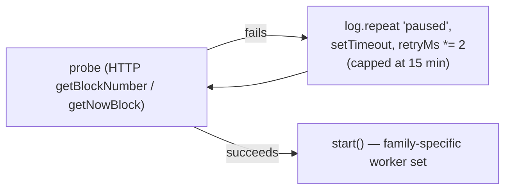

# Workers

Every worker is an in-process loop — `setInterval`, or a WebSocket subscription plus a
periodic safety net — started from `src/index.ts` (network-scoped workers) or
`startExpirer()` (the two DB-only loops). There is no queue and no leader election: one
deployed replica runs all of them, which is why `railway.json` pins `numReplicas: 1` — see
[Overview](/architecture/overview).

## Supervisor: gating on a live RPC

`workers/supervisor.ts` is what `src/index.ts` actually calls per network
(`superviseNetwork`). It probes the network — `getBlockNumber()` on EVM, `getNowBlock()`
on Tron — and only starts that network's workers once the probe succeeds:



This exists because opening a WebSocket against a network the Alchemy app has not
enabled makes viem's reconnect loop print a raw error straight past any log formatting
(`setup().catch(console.error)` inside the library, uninterceptable). Probing first over
HTTP keeps that noise out and lets a network's workers start on their own, without a
restart, the moment its credential or its provider-side toggle becomes valid. Retry
backoff doubles from 60 seconds up to a 15-minute cap — a network stuck unreachable is
usually a configuration gap, not a blip, so the supervisor stops hammering it.

`start()` differs by family:

| Family | Workers started |
|---|---|
| `evm` | `watcher`, `nativeWatcher` (only if the network defines a native asset), `confirmer`, `sweeper`, `sweepRecon` |
| `tron` | `tronWatcher`, `tronConfirmer`, `sweeper` (no-op today — see below), `sweepRecon` (no-op today) |

## Per-worker summary

| Worker | File | Family | What it does |
|---|---|---|---|
| Token watcher | `workers/watcher.ts` | EVM | Alchemy WebSocket `watchContractEvent` on every token's `Transfer`, filtered server-side by the indexed `to` topic against open payments' addresses; a chunked `eth_getLogs` backfill covers WebSocket gaps |
| Native watcher | `workers/native-watcher.ts` | EVM | Reads block bodies to find native-coin (BNB, POL) transfers, which emit no event; gated so it reads nothing while no payment on the network is quoted in the native coin |
| Confirmer | `workers/confirmer.ts` | EVM | Advances mature deposits to `confirmed`, with an anti-reorg receipt re-check; unwinds a deposit whose transaction vanished or reverted |
| Tron watcher | `workers/tron-watcher.ts` | Tron | Polls TronGrid for TRC-20 transfers into open addresses, and for native TRX transfers into addresses quoted in TRX; this **is** the primary detection path, not a backfill, since Tron has no push subscription |
| Tron confirmer | `workers/tron-confirmer.ts` | Tron | Same contract as `confirmer.ts`, over TronGrid's HTTP API instead of viem |
| Expirer | `workers/expirer.ts` | both | `expireStalePayments()` every 20s — moves lapsed quotes/grace windows to `expired`/`underpaid_expired` |
| Webhook delivery | `workers/expirer.ts` (`startExpirer`) | both | `deliverPendingWebhooks()` every 5s — the same loop-starter as the expirer, despite the file name |
| Sweeper | `workers/sweeper.ts` | EVM only, execution; Tron plans but never executes | Plans and (unless dry-run) executes moving confirmed deposit-address value to the treasury — see [Sweeping](/architecture/sweeping) |
| Sweep reconciliation | `workers/sweep-recon.ts` | EVM only | Reads on-chain balances and compares them with the ledger's expectation — the one legitimate use of `balanceOf`/`getBalance` in the codebase |

## Cadence

Every interval below is an environment dial (`src/config.ts`), not a constant, except the
two marked fixed:

| Worker | Env var | Default |
|---|---|---|
| Token watcher — backfill | `BACKFILL_INTERVAL_SEC` | 300s (5 min) |
| Token watcher — resubscribe | *(fixed)* | 15s |
| Native watcher — backfill | `BACKFILL_INTERVAL_SEC` | 300s (5 min) |
| Native watcher — refresh watched set | *(fixed)* | 15s |
| Confirmer (EVM) | `CONFIRMER_INTERVAL_SEC` | 30s |
| Tron watcher (poll) | `TRON_POLL_INTERVAL_SEC` | 60s |
| Tron confirmer | `CONFIRMER_INTERVAL_SEC` | 30s (shared with the EVM confirmer's dial) |
| Expirer | *(fixed)* | 20s |
| Webhook delivery | *(fixed)* | 5s |
| Sweeper | `SWEEP_INTERVAL_SEC` | 120s |
| Sweep reconciliation | `SWEEP_RECON_INTERVAL_SEC` | 3600s (1 hour) |

Two more dials shape cost rather than cadence: `BACKFILL_BLOCKS` (50) and
`LOG_RANGE_BLOCKS` (10) bound the EVM token backfill's span and per-call chunk size — the
free Alchemy tier caps a single `eth_getLogs` call at 10 blocks — and
`NATIVE_BACKFILL_BLOCKS` (20) bounds the native watcher's re-scan window, kept separate
and much smaller because its cost is one call *per block*, not per chunk.

## The database-before-provider rule

Every worker above asks Postgres — free, local — before it asks a metered provider, and
returns early when there is nothing to do:

- The confirmers select unconfirmed deposits first; with zero rows, they never call
  `getBlockNumber()` at all.
- The token and native watchers query open payments before touching the chain; with zero
  open payments, a resubscribe or backfill tick is a single free `SELECT`.
- The sweeper's `plan()` reads `candidates()` from the database before pricing anything.

This is not an optimization applied after the fact — it is why the idle provider-call
count in `README.md`'s cost table dropped from roughly 780/hour to roughly 4/hour. A
network with no open payments and nothing maturing costs nothing beyond its own liveness
probe.

## EVM vs. Tron: why the families need different workers

The token watcher and the native watcher are separate files because the two kinds of
transfer are detected in fundamentally different ways, and the difference is not
EVM-specific — it recurs on Tron too:

- A **token transfer** is a `Transfer` event. A node indexes it, and both the WebSocket
  subscription and `eth_getLogs` can filter it server-side by the indexed recipient
  topic, so watching costs nothing while nobody is being paid in that token.
- A **native-coin transfer** (BNB, POL, TRX) is a field on the transaction itself —
  nothing indexes it, no subscription filters it, and `eth_getLogs` cannot see it. The
  only way to find one is to read the block and inspect every transaction in it. The
  native watcher is built entirely around not paying that cost until it has to: it reads
  nothing at all unless some payment on the network is open **and** quoted in the native
  coin.

Tron compounds this with a second, orthogonal difference: it has no WebSocket log
subscription at all. `tron-watcher.ts` polling **is** the primary detection path, not a
backfill — its interval (`TRON_POLL_INTERVAL_SEC`) is the actual detection latency, unlike
the EVM backfill, which only has to catch what a WebSocket reconnect missed. TronGrid's
transfer listing also carries neither a block number nor a log index, so each candidate
is resolved against the transaction's own event log (`gettransactioninfobyid`), and the
amount is re-read from that log rather than trusted from the listing — the log's position
becomes the `logIndex` that keeps `deposits` idempotent, exactly as a real EVM log index
would.

Both families' watchers bound deposits in time the same way: a transfer only settles a
payment if it arrived at or after the payment was created, checked twice on Tron (once in
the TronGrid query's `min_timestamp`, once locally) because an HD address can carry
history that predates the payment it was just assigned to.

## Native-watcher idle gate, precisely

The gate mentioned above is not a heuristic — it is the whole cost model, stated directly
in the worker's own comment:

```ts
// it reads nothing at all unless some payment on this network is open *and*
// quoted in the native coin (the common case is zero, and then this worker
// costs one cheap subscription and no calls);
```

Concretely: `refreshWatched()` queries open payments filtered to the network's native
symbol; when that set is empty, a new block head is acknowledged (the cursor advances so
a later payment does not replay the idle stretch) but the block body is never fetched.
The subscription to new block *headers* stays open regardless — headers are cheap and
carry no bodies — but the expensive step, `eth_getBlockByNumber` with full transactions,
only runs while at least one payment on that network is quoted in its native coin. A
checkout offering BNB or POL should expect roughly one such call per block for as long as
the payer takes; quoting the stablecoin instead avoids it entirely.

## Sweeper and reconciliation: started everywhere, doing nothing where unimplemented

`startSweeper` and `startSweepRecon` are called for every network by the supervisor
regardless of family, and each decides internally whether it has anything to do:

- The sweeper returns immediately when `SWEEP_ENABLED` is unset, and again when the
  network's family has no execution path yet (Tron's mechanism — delegated energy — is
  Phase 3 of the sweeping plan). Tron pairings are still *planned* by the shared policy in
  `services/sweeper.ts`; they resolve to `skipped: unimplemented` rather than silently
  not existing.
- Reconciliation returns when neither `SWEEP_RECON_ENABLED` nor `SWEEP_ENABLED` is set,
  and again on a non-EVM family, since it has no balance reader for Tron yet.

See [Sweeping](/architecture/sweeping) for what each phase actually does.
